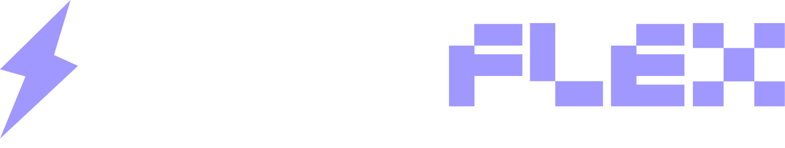

<div align="center">
  
  <p>A modern interface enhancement extension for university learning management systems</p>
  
  <p>
    <a href="https://github.com/ajmalrazaqbhatti/superflex"></a>
    <a href="https://github.com/ajmalrazaqbhatti/superflex/issues"></a>
    <a href="https://github.com/ajmalrazaqbhatti/superflex/blob/master/LICENSE"></a>
  </p>
  
  <p>
    <a href="https://ajmalrazaqbhatti.github.io/superflex">Website</a> •
    <a href="#features">Features</a> •
    <a href="#installation">Installation</a> •
    <a href="#development">Development</a> •
    <a href="#contributing">Contributing</a>
  </p>
</div>

## Overview

SuperFlex is the ultimate glow-up for that crusty university Flex portal at NUCES that was giving major 2005 vibes. It's literally a browser extension that said "challenge accepted" and transformed the ancient interface into this sleek, dark-mode masterpiece. It's not just a pretty face though - we've added so many features that your productivity is about to be *chef's kiss* 🔥

This bad boy works by sneaking React components into the boring old LMS pages, basically performing plastic surgery on the UI. No cap, it's the ultimate uni life hack that the administration wasn't ready for. Flex portal? More like FLEX on your classmates with this aesthetic upgrade! 😎

## Features

### 🎨 Modern UI/UX
- **Dark Mode**: Easy on the eyes with a sleek dark theme
- **Custom Typography**: Improved readability with Product Sans font
- **Animated Components**: Smooth transitions and loading states

### 📊 Enhanced Dashboards
- **Attendance Visualization**: Visual progress bars for attendance tracking
- **Grade Summaries**: At-a-glance view of course performance
- **CGPA Calculator**: Plan future semesters and calculate required grades
- **PLO Attainment Tracking**: Monitor program learning outcomes

### 🛠️ Improved Functionality
- **Smart Tables**: Sortable, filterable academic data
- **Collapsible Sections**: Better organize content with expandable accordions
- **Custom Navigation**: Streamlined access to important features


## Supported Pages

SuperFlex enhances the following university LMS pages:

- **Home Page**: Dashboard with key student information
- **Transcript Page**: Academic records with GPA calculator
- **Marks Page**: Course marks with performance visualization
- **Attendance Page**: Attendance tracking with statistics
- **Study Plan Page**: Curriculum planning with modern interface
- **Course Feedback Page**: Improved feedback submission forms
- **Grade Change Page**: Streamlined grade appeal process
- **Fee Details Page**: Clearer financial information display
- **Retake Exam Page**: Simplified exam registration process


### Installation
1. Download the latest release from the [GitHub Releases page](https://github.com/ajmalrazaqbhatti/superflex/releases)
2. Unzip the downloaded file
3. Open Chrome and go to `chrome://extensions/`
4. Enable "Developer Mode" in the top right
5. Click "Load Unpacked" and select the unzipped folder
6. SuperFlex will now be active when you visit your university LMS

## Development

SuperFlex is built with modern web technologies:

- **React**: Component-based UI library
- **Vite**: Fast build tooling
- **Tailwind CSS**: Utility-first CSS framework
- **CRXJS**: Chrome extension development tools

### Prerequisites
- Node.js (v16+)
- npm or yarn
- Chrome browser

### Setup Development Environment
1. Clone the repository:
```bash
git clone https://github.com/ajmalrazaqbhatti/superflex.git
cd superflex
```

2. Install dependencies:
```bash
npm install
# or
yarn
```

3. Start the development server:
```bash
npm run dev
# or
yarn dev
```

4. Load the extension in Chrome:
   - Go to `chrome://extensions/`
   - Enable "Developer Mode"
   - Click "Load Unpacked"
   - Select the `dist` folder from your project directory

5. The extension will automatically reload when you make changes

### Project Structure
```
superflex/
├── public/             # Static assets
├── src/
│   ├── components/     # React components
│   │   ├── layouts/    # Layout components
│   │   └── pages/      # Page-specific components
│   ├── styles/         # CSS and Tailwind configuration
│   ├── content.jsx     # Content script entry point
│   └── index.jsx       # Extension entry point
├── manifest.json       # Extension manifest
└── vite.config.js      # Vite configuration
```

## Building for Production

To create a production build:

```bash
npm run build
# or
yarn build
```

The production build will be available in the `dist` folder, ready to be published or loaded as an unpacked extension.

## Contributing

Contributions are welcome! Please feel free to submit a Pull Request.

1. Fork the repository
2. Create your feature branch (`git checkout -b feature/amazing-feature`)
3. Commit your changes (`git commit -m 'Add some amazing feature'`)
4. Push to the branch (`git push origin feature/amazing-feature`)
5. Open a Pull Request

Please make sure your code follows the project's coding style and includes appropriate tests.

## License

This project is licensed under the MIT License - see the [LICENSE](LICENSE) file for details.

## Acknowledgements

- The university community for providing feedback and feature suggestions
- All contributors who have helped improve SuperFlex
- [Lucide Icons](https://lucide.dev/) for beautiful UI icons

## Contact

Ajmal Razaq Bhatti - [@ajmalrazaqbhatti](https://github.com/ajmalrazaqbhatti)

Project Link: [https://github.com/ajmalrazaqbhatti/superflex](https://github.com/ajmalrazaqbhatti/superflex)

## Disclaimer

SuperFlex is an independent project that redesigns the Flex portal of NUCES university. This extension is not affiliated with, endorsed by, or sponsored by NUCES university.

This is my personal project intended to enhance my learning experience. I did not hack anything or intend to do so. SuperFlex merely applies cosmetic changes to the user interface without compromising any security measures or accessing unauthorized data. This project should not warrant any academic warnings or disciplinary actions as it respects the system's integrity and security.

Users are using this extension at their own consent and responsibility. The creator of SuperFlex is not responsible for any issues that may arise from using this extension, including but not limited to academic discrepancies, data inaccuracies, or system incompatibilities.

By installing SuperFlex, you acknowledge that you are using a third-party modification to the university's official system and do so at your own risk.
